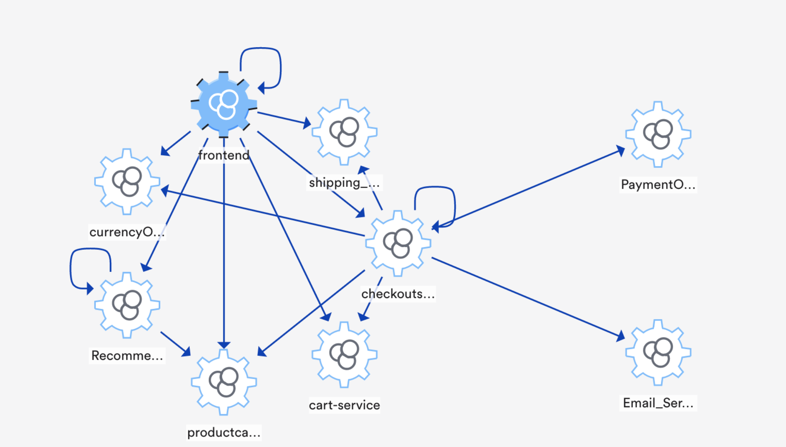

# HipsterShop
Hipster Shop is a cloud-native microservices demo application .Google uses this application to demonstrate use of technologies like Kubernetes/GKE, Istio, Stackdriver, gRPC and OpenCensus.
This application works on any Kubernetes cluster, as well as Google Kubernetes Engine. It’s easy to deploy with little to no configuration.

## Architecture

**Online Boutique** is composed of 11 microservices written in different
languages that talk to each other over gRPC.

[](./architecture-diagram.png)

The following table represents functionality of each microservice.


| Service                                              | Language      | Description                                                                                                                       |
| ---------------------------------------------------- | ------------- | --------------------------------------------------------------------------------------------------------------------------------- |
| [frontend](./frontend)                           | Go            | Exposes an HTTP server to serve the website. Does not require signup/login and generates session IDs for all users automatically. |
| [cartservice](./cartservice)                     | C#            | Stores the items in the user's shopping cart in Redis and retrieves it.                                                           |
| [productcatalogservice](./productcatalogservice) | Go            | Provides the list of products from a JSON file and ability to search products and get individual products.                        |
| [currencyservice](./currencyservice)             | Node.js       | Converts one money amount to another currency. Uses real values fetched from European Central Bank. It's the highest QPS service. |
| [paymentservice](./paymentservice)               | Node.js       | Charges the given credit card info (mock) with the given amount and returns a transaction ID.                                     |
| [shippingservice](./shippingservice)             | Go            | Gives shipping cost estimates based on the shopping cart. Ships items to the given address (mock)                                 |
| [emailservice](./emailservice)                   | Python        | Sends users an order confirmation email (mock).                                                                                   |
| [checkoutservice](./checkoutservice)             | Go            | Retrieves user cart, prepares order and orchestrates the payment, shipping and the email notification.                            |
| [recommendationservice](./recommendationservice) | Python        | Recommends other products based on what's given in the cart.                                                                      |
| [adservice](./adservice)                         | Java          | Provides text ads based on given context words.                                                                                   |
| [loadgenerator](./loadgenerator)                 | Python/Locust | Continuously sends requests imitating realistic user shopping flows to the frontend.                                              |


## Development Guide 

This doc explains how to build and run the Hipstershop source code locally.  
  

### Screenshot

 [](./Dag.png)

## You can setup the application in two ways :-
    1. Docker
    2. Local Machine.


## Steps to run on Docker

1. Clone the project.
2. If collector is not already setup, setup lmotel collector using following command:

    ```sh
     
    docker run -d -e LOGICMONITOR_ACCOUNT=your_account_name -e LOGICMONITOR_BEARER_TOKEN=your_bearer_token -e LOGICMONITOR_OTEL_NAME="collector_name" -p 55680:55680 -p 55681:55681 -p 4317:4317 -p 4318:4318 logicmonitor/lmotel:latest
     
      ```
3. Open the terminal and go to hipster folder. Execute following command.
  
     ```sh
    export OTLP_FORMAT="OTLP_FORMAT" // values can be HTTP or GRPC
    export SERVICE_NAMESPACE="SERVICE_NAMESPACE"
    export OTLP_ENDPOINT="YOUR_ENDPOINT" //need to append /v1/traces for OTLP HTTP format
    export OTEL_EXPORTER_OTLP_HEADERS="Authorization=Bearer YOUR_BEARER_TOKEN" //Required for otlp http format if sending traces directly to LM platform
    export OTEL_RESOURCE_ATTRIBUTES="KEYVALUEPAIR"  // values to be comma seperated eg:"key1=value1,key2=value2"
    docker-compose up -d
     
      ```

    For AdService exporter endpoint need to be set manually in docker-compose.yml file.
    Opentelemetry java agent appends /v1/traces for OTLP HTTP format.
    OTLP_PROTOCOL values can be set either grpc of http/protobuf 

4.  Access the web frontend through your browser 
  
  - Once run above all steps you can access frontend service at  http://localhost:8081
  
Once all four steps are completed successfully,you can view the traces on Logicmonitor Traces page.

# When to use OTLP/HTTP or OTLP/gRPC

 - **OTLP/gRPC**
    -  OTLP/gRPC is preferred when sending data via collector.
    -  This protocol is concerned with reliability of delivery between one pair of client/server nodes and aims to ensure that no data is lost in-transit between the client and the server. Many telemetry collection systems have intermediary nodes that the data must travel across until reaching the final destination (e.g. application -> agent -> collector -> backend)
    - eg: http://localhost:4317
 - **OTLP/HTTP**
    -  OTLP/HTTP is preferred while sending data directly to platform using url without sending it to collector.
    -  OTLP/HTTP uses Protobuf payloads encoded either in binary format or in JSON format.
    -  OTLP/HTTP uses HTTP POST requests to send telemetry data from clients to servers.
    -  eg: https://qauattraces01.logicmonitor.com/rest/api/v1/traces

For more information, visit [OpenTelemetry Protocol Specification.](https://opentelemetry.io/docs/reference/specification/protocol/otlp/)

## Steps to run on Local Machine


### Prerequisites 
- [Docker for Desktop](https://www.docker.com/products/docker-desktop).
- JDK 11
- Installation of Go
- Installation of Python
- Installation of Node
- Installation of Dotnet core.
- Visual Studio


1. Currency Service (Node.js)

    ```sh
    cd currencyservice
    npm i 
    node -r ./tracing server.js 
    
    ```
2. Cart Service (C#)
      
    ```sh
    Open and Run the cart service in Visual Studio.
    OR
    cd cartservice
    dotnet run
    
    ```
  
3. Payment Service (Node.js)
  
    ```sh
    cd paymentservice
    node -r ./tracing index.js  
    
    ```
    
4. Recommendation Service (Python)
  
    ```sh
    cd recommendationservice
    pip3 install -r requirements.txt
    export PORT=8082
    export EXPORT_TYPE="OTLP"
    export SERVICE_NAME=LM-RECOMMENDATIONSERVICE
    export OTLP_ENDPOINT=http://localhost:55681/v1/traces
    export SERVICE_NAMESPACE=HIPSTER
    export PRODUCT_CATALOG_SERVICE_ADDR=localhost:4000
    opentelemetry-instrument python3 recommendation_server.py
    
    ```
    
5. Shipping Service (Go)
  
    ```sh
    cd shippingservice
    go run . .
    
    ```
    
6. ProductCatlog Service (Go)
  
    ```sh
    cd productcatalogservice
    go run . .
    
    ```
    
7. Checkout Service (Go)
  
    ```sh
    cd checkoutservice
    go run . .
    
    ```
8. Email Service (Python)

    ```sh
    cd emailservice
    pip3 install -r requirements.txt
    export PORT=4009
    export EXPORT_TYPE="OTLP"
    export SERVICE_NAME=LM-EMAILSERVICE
    export OTLP_ENDPOINT=http://localhost:55681/v1/traces
    export SERVICE_NAMESPACE=HIPSTER
    opentelemetry-instrument python3 email_server.py
    
    ```
    
9. Ad Service (Java)


        cd adservice
        gradle build
        java -javaagent:opentelemetry-javaagent-all.jar \
        -Dotel.exporter=otlp \
        -Dotel.resource.attributes=$OTEL_RESOURCE_ATTRIBUTES ,service.name=$SERVICE_NAME,host.name=$HOST_NAME \
        -Dotel.exporter.$EXPORTER.endpoint=http://localhost:4317 \
        -Dotel.exporter.otlp.insecure=true \
        -Dotel.exporter.otlp.protocol=$OTLP_PROTOCOL \
        -jar hipstershop-0.1.0-SNAPSHOT-fat.jar
     
     
 > Note : Download opentelemetry-javaagent-all.jar : https://github.com/open-telemetry/opentelemetry-java-instrumentation/releases/download/v1.7.0/opentelemetry-javaagent-all.jar and copy the jar file in folder adservice/tracinglib    

 10.  Access the web frontend through your browser 
  
  - Once run above all steps you can access frontend service at  http://localhost:8081
  - Once all four steps are completed successfully,you can view the traces on Logicmonitor Traces page.

Also, the following env variables are needed to be set explicitly for every service while running locally:
  - SERVICE_NAME
  - SERVICE_NAMESPACE
  - OTLP_ENDPOINT
  - OTLP_FORMAT
  - EXPORT_TYPE
  - OTEL_RESOURCE_ATTRIBUTES
  - OTEL_EXPORTER_OTLP_HEADERS

    


